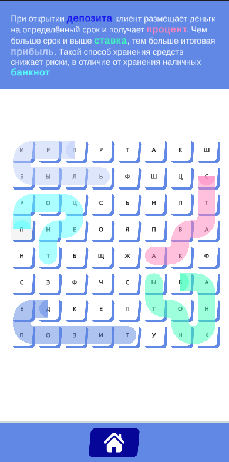
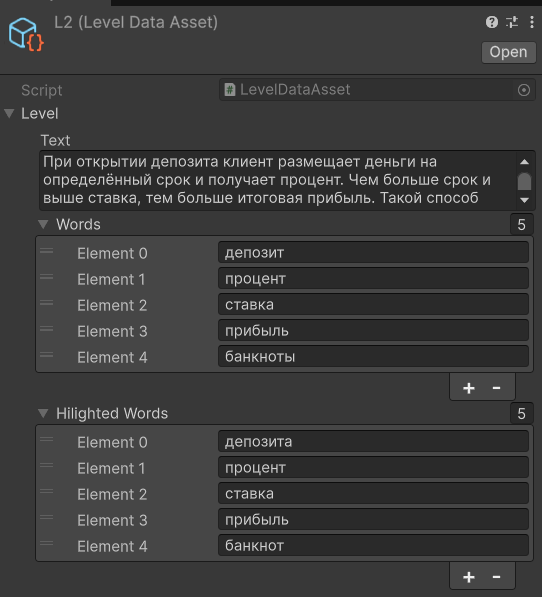
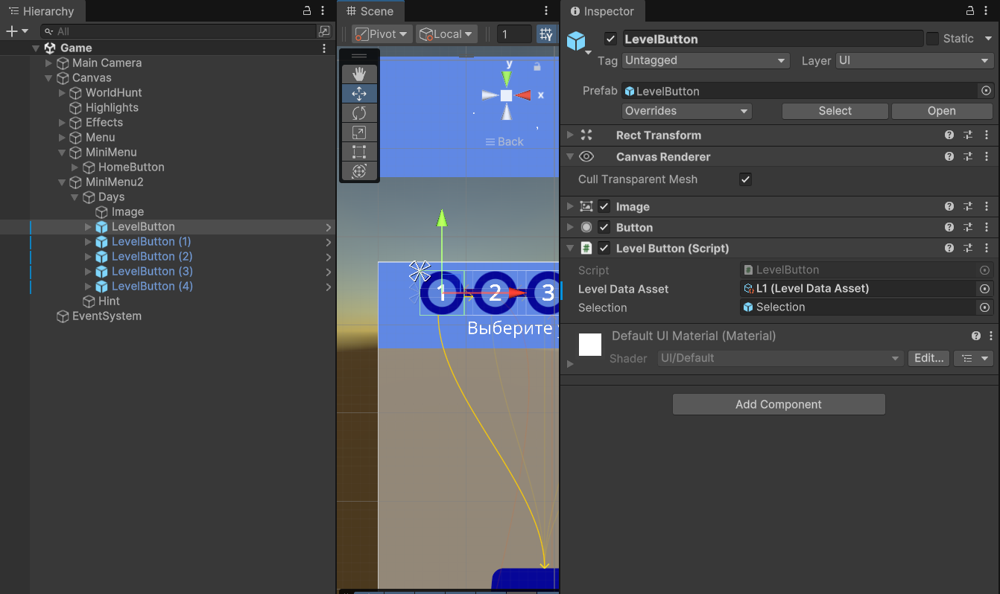

# ФинСлова — игра в слова для повышения финансовой грамотности

> Проект, сделанный на хакатоне для «Газпром» — лёгкая обучающая игра-антипазл: читайте короткий текст и находите ключевые термины на поле из букв. Игра помогает закреплять базовые понятия (депозит, процент, ставка, прибыль и др.) в контексте.

## 🎮 Как играть
1. Выберите уровень в меню дней.
2. Прочитайте абзац — в нём **подсвечеваются** термины, которые нужно найти на поле.
3. Находите слова, проводя пальцем/мышью по соседним буквам (по горизонтали/вертикали).
4. Найдите все слова — уровень пройден!

  

---

## 🧩 Создание нового уровня

### 1) Создайте `LevelDataAsset`
В Unity: **Create → Scriptable Objects → LevelDataAsset**.

Заполните поля в инспекторе:
- **Text** — абзац с обучающим описанием.
- **Words** — список слов, которые нужно найти на поле.
- **Highlighted Words** — формы слов, которые будут выделены в тексте (склонения/падежи и т. п.).

> Подсветка в тексте берётся из `Highlighted Words`, а слова на поле — из `Words`.

  

### 2) Добавьте кнопку уровня в меню
Перейдите в сцену с меню уровней и добавьте префаб **`LevelButton`** в список уровней.  
В инспекторе укажите созданный `LevelDataAsset` в поле **Level Data Asset**.

  

Готово — новый уровень появится в меню и будет доступен для запуска.

---
## 📦 Стек
- **Unity** (UI, ScriptableObjects, анимации)
- **TextMeshPro** (подсветка терминов в тексте)
- Собственные скрипты для генерации сетки букв и проверки слов

---

## 📝 Лицензия
MIT